# LiteMES(Free and open-source MES system)
Current latest version: v1.5.5 (Release date: 2025-04-29)


[](https://gitee.com/leepm/mini-contract/blob/master/LICENSE) [](https://gitee.com/leepm/LiteMES)[](https://gitee.com/leepm/LiteMES)


## What is LiteMES?

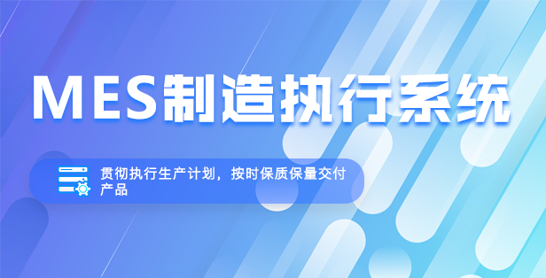

LiteMES is a production manufacturing execution MES system tailored for enterprises of all sizes, from large to small. The system is developed based on industry-standard open-source projects and integrated with real business scenarios, aiming to provide a comprehensive, efficient, and easy-to-use production management tool. Additionally, LiteMES supports the integration of IoT devices, such as surveillance cameras and fire alarms.


 The six core modules of LiteMES are: Scheduling, Warehouse Management, Manufacturing Execution, Quality Management, IoT Management, and Dashboard Reporting.


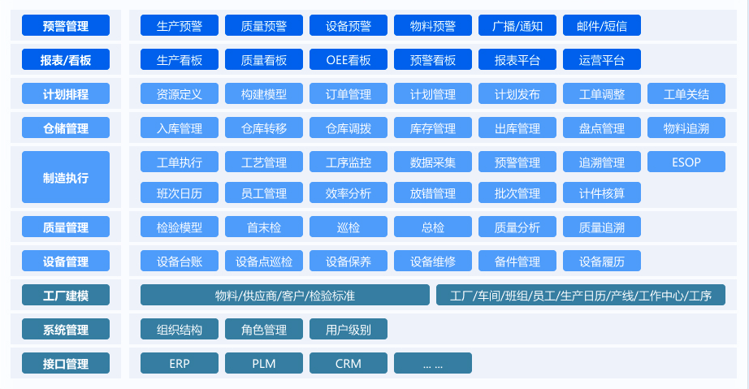


## What is our advantage?

For small enterprises with limited resources, the **low-cost investment and high cost-performance ratio** of LiteMES is their greatest benefit. The system is designed in a modular way, allowing companies to flexibly choose the modules they need based on their own requirements and budget, avoiding unnecessary functional stacking and cost waste. In addition, the lightweight design of LiteMES reduces the system's high demands on hardware, further reducing the IT investment costs for enterprises.

In terms of ease of use, LiteMES provides an intuitive graphical user interface and simplified operation process, allowing even employees with weaker technical backgrounds to quickly master the method of use. The system's rapid deployment and convenient maintenance enable enterprises to achieve the digital transformation of production management with the minimum IT support requirements.


## Applicable business scenarios

#### Industry

- Electronic Industry
- Food Processing Industry
- Other Small, Medium, and Micro-sized Manufacturing Enterprises

#### Features

- Paperless Production Process Control

  - Paperless Process Execution and Workflow Tracking
  - Data Collection and Analysis for SMT, Manual Operations
  - Plug-in and Micro-assembly Process Monitoring and Management

- Comprehensive Quality Traceability and Analysis

  - Full Product Lifecycle Traceability Based on the Product
  - Analysis, Monitoring, and Timely Detection of Defects to Improve Product Quality

- Equipment Status Monitoring and Data Collection
  - Industrial Control Network at the Foundation Layer for Equipment Networking, Status Monitoring, and Data Collection

- Digital Dashboard and Analysis
  - Reports, Alerts, Real-time Dashboards, and Operational Dashboards.


## Supported Business Interfaces

- MES Backend Management Interface (Business Management)
- MES Production Interface (Work Reporting)
- MES Mobile Interface (Inspection, Warehouse Operations, Inventory Counting, After-Sales Service)

####  Development Architecture

- Language: Java 8+ (less than 17), Vue 2.0
- IDE (Java): IntelliJ IDEA (lombok plugin must be installed)
- IDE (Frontend): Visual Studio Code, HBuilder
- Dependency Management: Maven (backend), npm (frontend)
- Caching: Redis
- Database Scripting: MySQL

### **Backend**

- Base Framework: Spring Boot
- Persistence Layer Framework: MyBatis
- Security Framework: Apache Shiro 1.10.0, Jwt 3.11.0
- Others: fastjson, poi, Swagger-ui, quartz, lombok (for simplifying code), etc.

```
Project Structure

├─ ktg-admin            System Management Module
├─ ktg-common           Common Utilities Module
├─ kgt-flowable         Workflow Module
├─ ktg-framework        Core Framework Module
├─ ktg-generator        Code Generation Module
├─ ktg-mes              Main System Module
└─ ktg-quartz           Scheduled Task Module
```

### Frontend

#### Frontend Framework

| Description | Framework | JS Version | State Management |
|-------------|-----------|------------|------------------|
| Base Framework | Element UI | JS Version | ES6 |
| Basic JS Framework | Vue.js | State Management | Vuex |
| CSS Preprocessing | SCSS | | |

```
├── .editorconfig                     // Code formatting configuration
│   ├── .env.development              // Local environment configuration
│   ├── .env.production               // Production environment configuration
│   ├── .env.test                     // Test environment configuration
│   ├── .eslintignore                 // ESLint ignored files configuration
│   ├── .eslintrc.js                  // ESLint checking configuration
│   ├── .gitignore                    // Git ignored files configuration
│   ├── package.json                  // Project version dependencies and other information
│   ├── README.md                     // Help documentation
│   └── vue.config.js                 // Development settings
├── build                             // Build configuration
├── public                            // Basic HTML configuration
└── src                               // Component area
    ├── api                           // API encapsulation
    ├── assets                        // Static resources
    ├── components                    // Common components
    ├── config                        // Configuration
    ├── directive                     // Custom directives
    ├── layout                        // Basic theme components
    ├── plugins                       // Basic methods and caching
    ├── router                        // Routing configuration
    ├── store                         // Vuex store management
    ├── styles                        // Common styles
    ├── utils                         // Utilities
    └── views                         // View components
```

## Project Outcome
## MES Backend Management (Business Management)
> Supports multi-tenant use in a standard SaaS model, offering high cost-performance and maintenance-free.

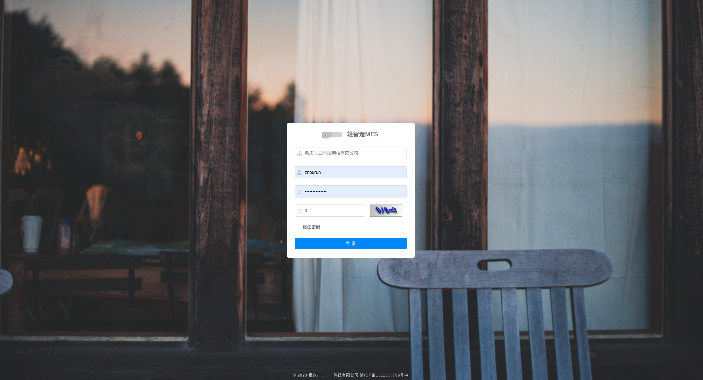

### Organization Management
#### Department Management
> Standardized organizational structure makes the division of responsibilities clearer and management duties more distinc

#### Role Management
> Functional permissions and business responsibilities can be freely defined and customized by management personnel, making management more convenient.


#### User Management
> Enterprises can manage their own employees and basic information of employees, including the authorization of permissions and responsibilities.


### Factory Management
#### Coding Rules
> To meet the needs of different business scenarios, we have specially designed a set of user and user-defined numbering generation rules.


#### Material and Product Management
> Products, materials, raw materials, packaging, and auxiliary materials can be uploaded by users themselves, and it is also possible to set up finished and semi-finished product warehouses, including uploading product photos and setting product expiration dates, etc.

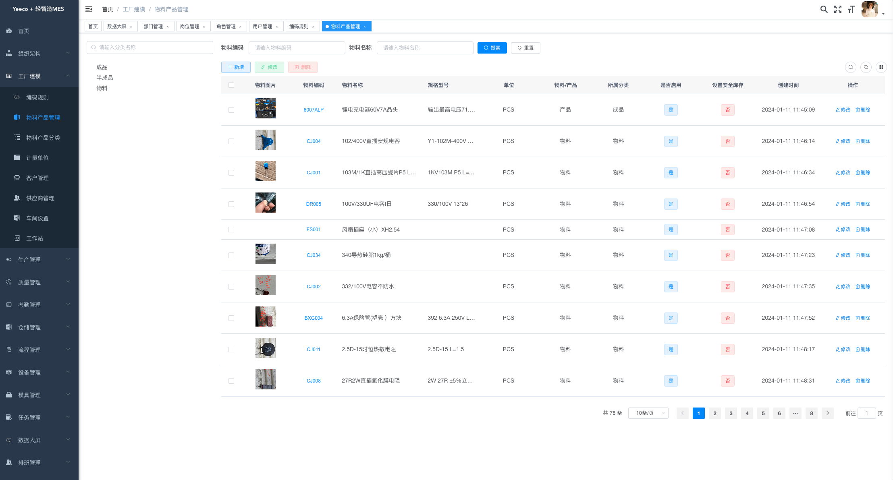


#### Material and Product Classification
Management personnel can set classifications such as finished products, semi-finished products, etc., according to their own business needs.

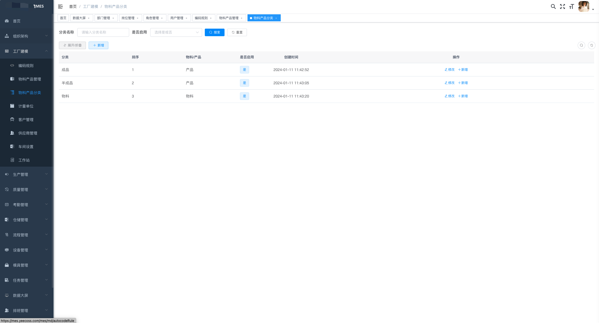

#### Measurement Units
> At the same time, we also support the conversion of multiple units, primary units, secondary units, and automatic calculation between primary and secondary units.

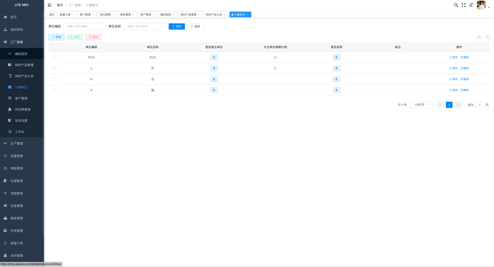

#### Customer Management
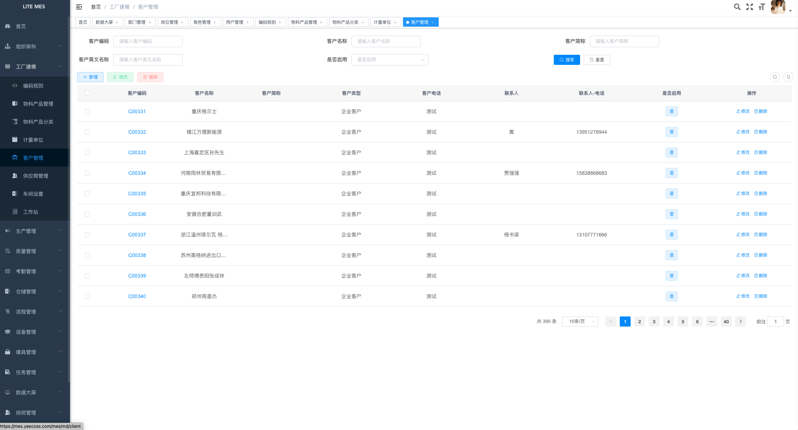

#### Supplier Management


#### Workshop Management
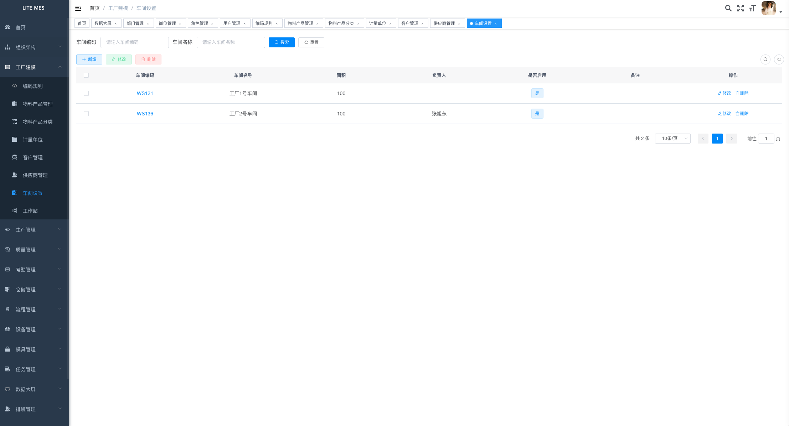

#### Workstation Management
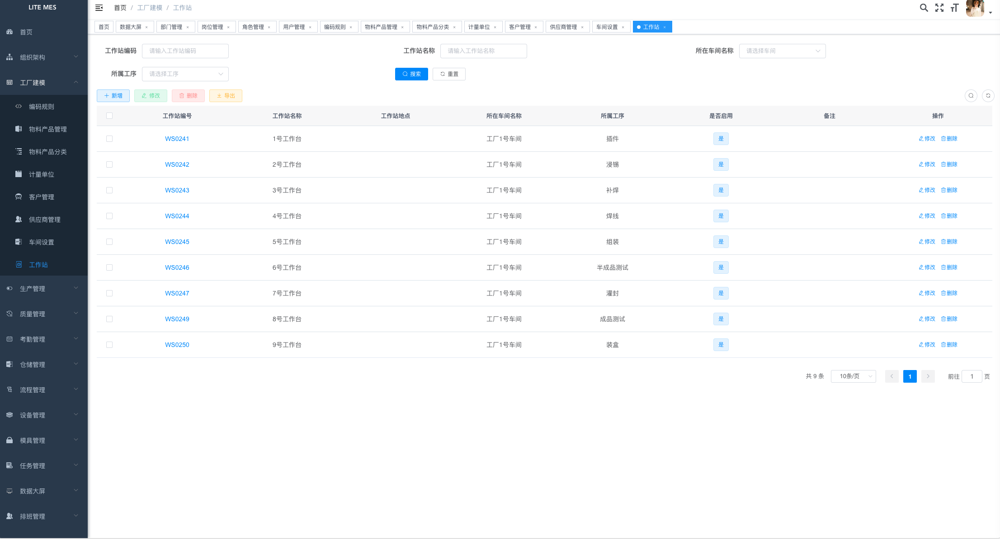

### Production Management

#### Production Planning Management

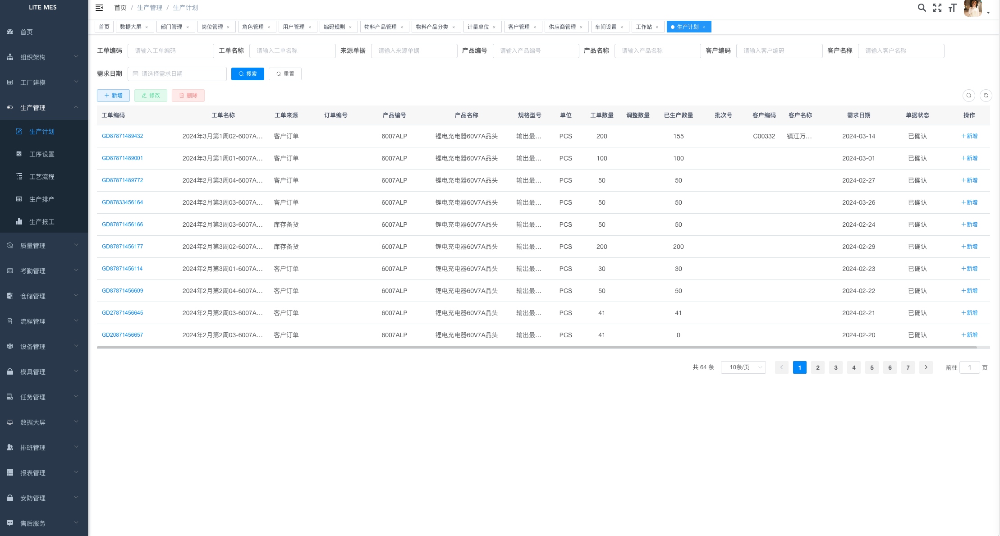

#### Process Setup


#### Process Flow


#### Production Scheduling


#### Work Reporting


### Quality Management

#### Common Defects

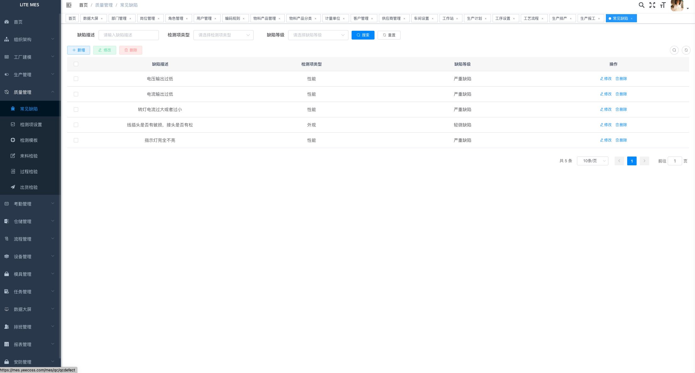

#### Inspection Item Management


#### Inspection Template


#### Incoming Material Inspection


#### In-process Inspection


#### Outgoing Inspection


### Attendance Management

#### Attendance Records


#### Work Calendar


#### Clock-in Location

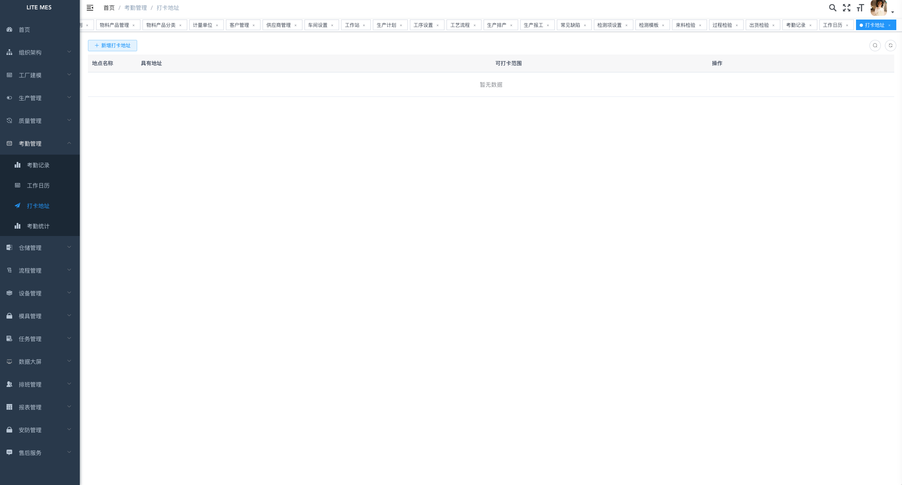

#### Attendance Statistics


## MES Production Side (Work Reporting)

### Workbench

> After logging in, production personnel select the appropriate workstation based on their process or link.

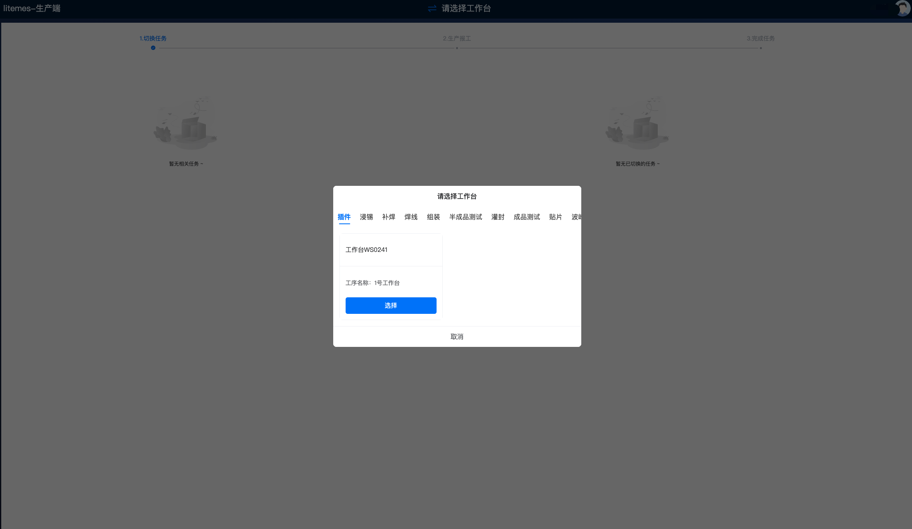

### Production Tasks

> Production personnel can view all pending or unfinished work tasks through the workbench and can report production data.

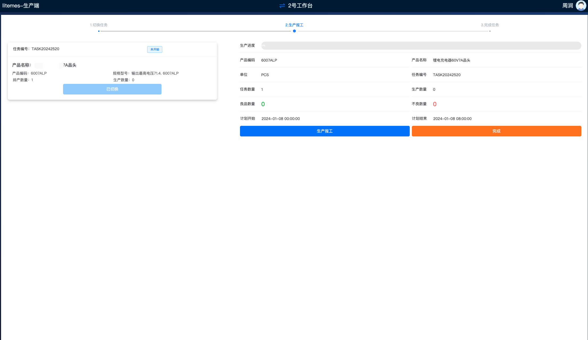

### Production Reporting

> Production personnel can report tasks on the production terminal, and after reporting, production managers can promptly view the corresponding data on the dashboard, allowing them to grasp the production progress in real time.

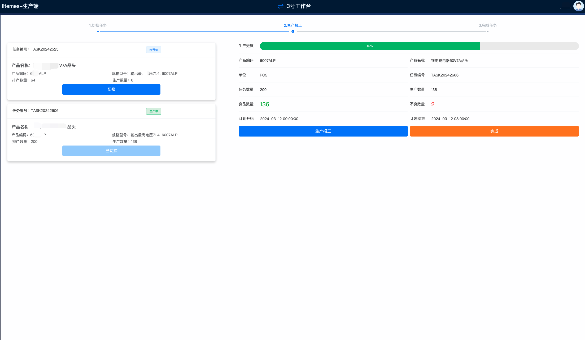

### Switch Workbench

> The production terminal supports reporting work for multiple processes at a single post, making it more flexible and convenient.

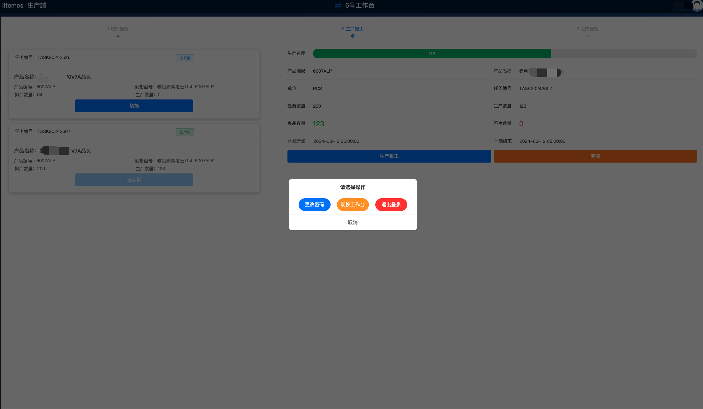


## MES Mobile Side (Inspection, Warehouse Operations, Inventory Counting, After-Sales Service)

### After-Sales Work Orders

> Users can use the mini-program to report product issues and apply for after-sales service, and also view the current status of the product's after-sales process in real time.

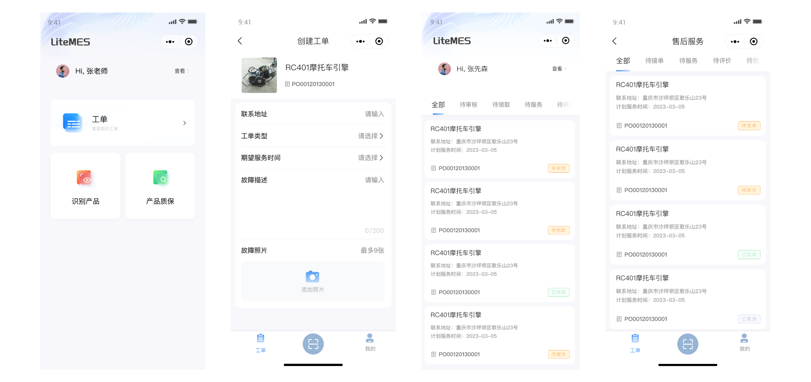


### Product Information

> Users can also query product information through the product QR code, viewing details such as production date, manufacturing process, quality control process, and warranty status.

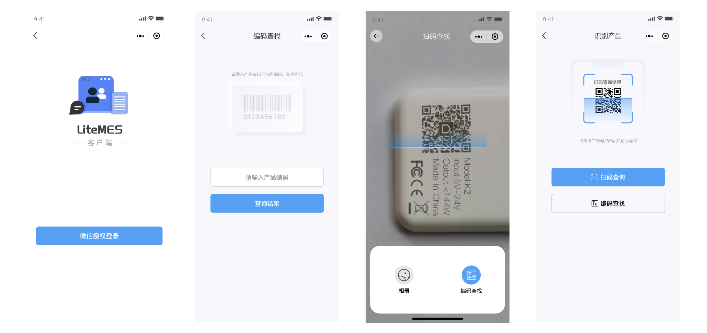

### Product Warehouse Operations

> Management users can conveniently perform operations such as product warehousing, dispatching, and material issuance through the mobile side.

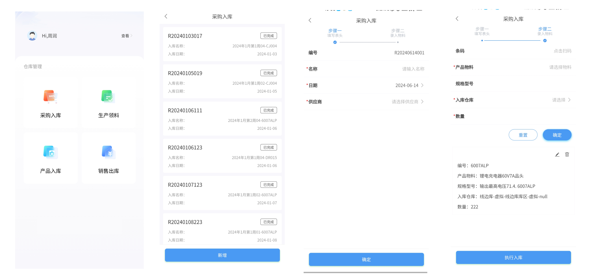

In summary, LiteMES not only enhances enterprise competitiveness with its efficient production management capabilities but also, with its high cost-performance ratio and low investment cost, has become an ideal choice for small enterprises to realize the dream of intelligent manufacturing. Through LiteMES, small enterprises can enjoy advanced production management technology at minimal cost, achieving optimization of the production process and business growth.

If you have any ideas, opinions, or suggestions about the LiteMES product, or if you have any business cooperation needs, please scan the QR code to add the LiteMES project team for further communication:


## Give Some Encouragement

If you think it's good, please consider watching, starring, and forking the project. ☺


